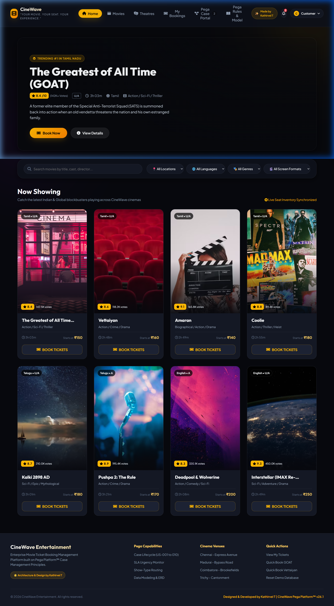

# CineWave Entertainment – Movie Ticket Booking Management System 🎟️

> **Enterprise Movie Ticket Booking Management Platform built with Pega Platform™ Case Management Architecture & Modern Dark Cinema UI.**  
> **Designed & Developed by:** **Kathirvel T**  
> **Tagline:** *“Your Movie. Your Seat. Your Experience.”*



---

## 🌟 Overview

**CineWave Entertainment** is a production-grade cinema ticketing and operations management application. It bridges a high-end customer booking portal (featuring realistic curved-screen seat layouts, real current blockbusters, dynamic pricing, and instant QR tickets) with a **Pega Platform™ Cosmos Case Worker & Operations Management Portal** (featuring 8-stage case lifecycles, real-time SLA urgency tracking, show-format routing, and inventory CRUD controls).

---

## 🚀 Key Features & User Stories (US-001 to US-010)

| User Story | Name | Implementation Description |
|---|---|---|
| **US-001** | **Submit Movie Ticket Request** | Customer booking form with validation (Customer Name, Email, Mobile, Movie, Theatre, Date, Show Time, Seats). Initializes Pega Case (`pyID`) and generates Booking ID (`CW20260828XXXX`). |
| **US-002** | **Check Show Availability** | Real-time seat inventory calculation: `Available Seats = Total Seats - Booked Seats`. Visual availability badges (🟢 Available, 🟡 Few Seats Left, 🔴 Sold Out). |
| **US-003** | **Calculate Booking Cost** | Dynamic price calculation: `Ticket Cost = Qty × Base Price × Tier Multiplier`, `Convenience Fee = Qty × ₹40`, `GST = 18% × Subtotal`, `Total = Subtotal + Fee + Tax` in INR (₹). |
| **US-004** | **Confirm Booking Request** | Mandatory customer confirmation checkbox before case finalization with "Modify Booking" and "Confirm & Book Now" actions. |
| **US-005** | **Maintain Movie & Show Data** | Cinema Manager & Admin portal with full CRUD operations for Movies, Theatres, Screens, Shows, and live capacity toggles. |
| **US-006** | **Review Booking Details** | Staff Review Screen in Pega Portal: Case Inspector, Approve, Reject (with mandatory rejection reason capture), Request Changes, and full Audit Trail. |
| **US-007** | **Process Ticket Booking** | Automated seat locking, ticket ID generation (`TKT-XXXXX`), and case status escalation to `Resolved-Completed`. |
| **US-008** | **Notify Booking Confirmation** | Multi-channel notifications (SMS, Email, In-App Notification Bell & Drawer), plus a Digital Cinema Ticket with a real scannable QR Code. |
| **US-009** | **Define Booking SLA** | Pega SLA Urgency Engine: Goal (10 mins), Deadline (30 mins), Passed Deadline. Urgency score (0–100) with visual health badges (🟢 Within SLA, 🟡 Approaching Deadline, 🟠 High Priority, 🔴 SLA Breached). |
| **US-010** | **Route Request by Show Type** | Automated Pega Routing: `IMAX` → *Premium Cinema Team*, `VIP` → *VIP Booking Team*, `Recliner` → *Premium Seating Team*, `Regular` → *Standard Booking Team*. |

---

## 🔄 Pega Case Lifecycle

```text
                 ┌──────────────────────────┐
                 │ 1. Submit Booking Request│
                 └─────────────┬────────────┘
                               ↓
                 ┌──────────────────────────┐
                 │ 2. Check Show Avail.     │
                 └─────────────┬────────────┘
                               ↓
                 ┌──────────────────────────┐
                 │ 3. Calculate Booking Cost│
                 └─────────────┬────────────┘
                               ↓
                 ┌──────────────────────────┐
                 │ 4. Review Booking Details│
                 └─────────────┬────────────┘
                               ↓
                 ┌──────────────────────────┐
                 │ 5. Customer Confirmation │
                 └─────────────┬────────────┘
                               ↓
                 ┌──────────────────────────┐
                 │ 6. Process Ticket Booking│
                 └─────────────┬────────────┘
                               ↓
                 ┌──────────────────────────┐
                 │ 7. Generate Ticket (QR)  │
                 └─────────────┬────────────┘
                               ↓
                 ┌──────────────────────────┐
                 │ 8. Notify Customer       │
                 └─────────────┬────────────┘
                               ↓
                      CASE RESOLVED-COMPLETED
```

---

## 🎭 Multi-Role Personas (Section 24)

- **Customer**: Browse movies, filter by city/theatre, select seats on visual layout, calculate dynamic costs, confirm booking, view digital QR tickets, manage and cancel bookings (with automatic seat release).
- **Booking Staff**: Manage workbaskets, review cases, inspect audit logs, approve/reject bookings with mandatory reason capture.
- **Cinema Manager**: Maintain movies catalog, add new show schedules, update pricing, toggle Sold Out/Cancelled statuses.
- **Administrator**: Monitor SLA health matrix, decision routing tables, and full Pega data model.

---

## 💻 Tech Stack

- **Frontend**: HTML5, Vanilla CSS3 (Dark Cinematic Glassmorphism, CSS Custom Properties, Responsive Grid & Flexbox), Vanilla JavaScript (ES6+ Modules)
- **Visuals & Icons**: Google Fonts (Outfit & Plus Jakarta Sans), FontAwesome 6, Chart.js, QRCode.js
- **Architecture**: Pega Platform™ Case Management, Data Modeling, SLA Engine, Workbasket Router
- **Backend / Server**: Node.js static HTTP server

---

## 🛠️ Getting Started Locally

### Prerequisites
- Node.js (v16 or higher)

### Run the Application
1. Clone this repository:
   ```bash
   git clone https://github.com/Kathirvel005/Movie-Ticket-Booking-Management.git
   cd Movie-Ticket-Booking-Management
   ```

2. Start the local server:
   ```bash
   node server.js
   ```

3. Open your browser and visit:
   ```
   http://localhost:3000
   ```

---

## 👤 Author & Architecture Credit

**Designed, Architected & Developed by:**  
**Kathirvel T**  
*CineWave Entertainment Pega Platform™ v26.1*
